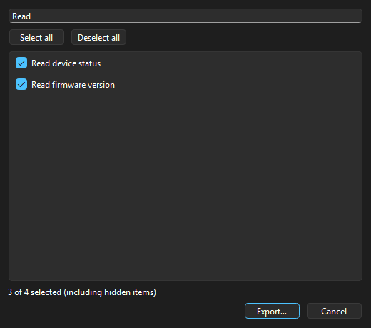
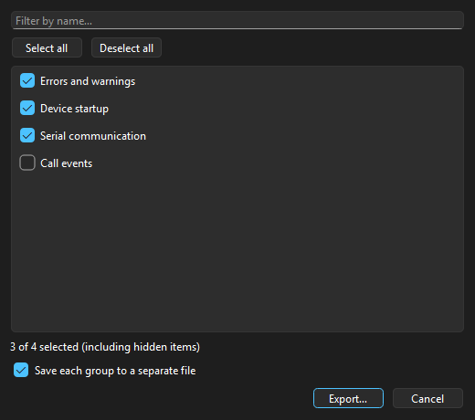

# Configuration exports and projects

Use **Tools → Export configurations** to export actions, highlight groups,
previews, predefined filters, or all preferences.

Actions, highlights, and previews offer checkboxes and a case-insensitive name
filter. Predefined filters offer checkboxes without a name filter. **Select all**
and **Deselect all** operate on the visible items; filtering preserves all check
states. The selection count includes hidden checked items. Export is disabled
when nothing is selected.

Highlight groups can be saved together in one `.conf` file or separately in a
chosen folder. Each separate filename starts with a number and a sanitized group
name, so duplicate names and characters forbidden in Windows filenames work.
The Export button in the highlights editor uses the same dialog and exports the
editor's current configuration.

Actions and previews use the existing JSON import formats. Actions retain their
IDs, parameters, expressions, checksums, order and enabled/hidden state.
Responses are included when all of their action dependencies are selected.
Previews retain their enabled state and include the reusable block library.
Highlights and predefined filters retain their IDs in the existing settings
format. Preferences include the complete application settings and shortcuts,
with definitions kept in their separate exports.

Use **File → Save project…** to save a `.cilogproj` manifest and a configuration
folder beside it. The project captures all current main windows, tab order, view
contexts, COM stream and script contexts, geometry, active tabs, all five
configuration exports and previously exported files registered by the main
window export commands or highlights editor. Each save writes a new snapshot
folder and commits the manifest last, preserving the previous project if saving
fails. Earlier snapshot folders can be removed after confirming they are no
longer referenced.

Use **File → Load project…** to validate and apply the saved configurations and
restore the session. Invalid or missing configuration references are reported
before replacing open tabs. Session restoration uses the existing file, COM,
and script restoration behavior. Missing log files are skipped with diagnostic
logs. Additional saved windows are created through the application's existing
window management.

Move or share the manifest together with its referenced configuration folder.
Configuration paths inside the manifest are relative. Log files remain at their
existing paths and are not copied into the project. If session log paths are
relative, they resolve from the directory containing the project.

Examples with sample configuration names:

