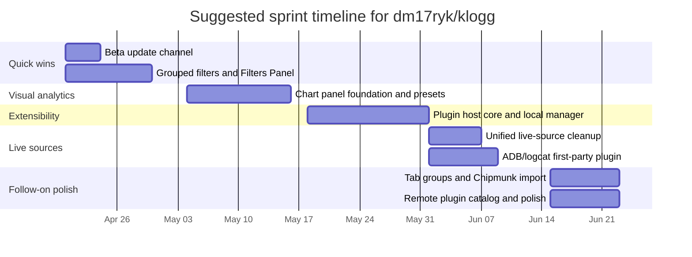

# Comparative Analysis of dm17ryk/klogg Against ZEACENT, LogSquirl, and the variar Fork Line

## Executive summary

**Connector used first and explicitly:** **GitHub**. I used the enabled GitHub connector to inspect repository manifests, selected source/build files, tests, and CI workflows for `dm17ryk/klogg`, `ZEACENT/klogg`, `64x-lunicorn/LogSquirl`, and representative public forks from the `variar/klogg` fork line. After that, I consulted a small set of primary external sources for upstream fork-count context and regex-engine portability context: the public GitHub page for `variar/klogg`, Intel’s official Hyperscan documentation, and the official VectorCamp Vectorscan repository page. fileciteturn75file0L1-L1 fileciteturn81file0L1-L1 fileciteturn86file0L1-L1 citeturn0search1turn1search0turn0search0

The central finding is that `dm17ryk/klogg` is **already the most operationally ambitious branch** of the family I inspected. It goes materially beyond the classic klogg baseline with commander/lab binaries, preview and action pipelines, script/scenario supervision, session and stream abstractions, serial/COM-related UI, and a wide cross-platform CI/package matrix. In other words, the repo is not lacking core ambition; it is missing a few **high-leverage product features and extensibility seams** that other branches have explored. fileciteturn77file0L1-L1 fileciteturn78file0L1-L1 fileciteturn79file0L1-L1 fileciteturn80file0L1-L1

`ZEACENT/klogg` is the best donor for **mechanically portable features** because it remains close to the classic klogg architecture while adding concrete improvements such as ADB/logcat integration, deeper live-source abstractions, streaming/concatenated log-data types, quick-label and filter-diff UI, tab-group handling, and benchmark discipline. `64x-lunicorn/LogSquirl` is the best donor for **strategic product ideas** because it adds a proper plugin host and SDK, local/remote plugin management patterns, charting, grouped filters plus a filters panel, Chipmunk import, JWT helpers, and a beta update channel—but it is farther away mechanically because it has moved to **Qt6-only and C++23**. fileciteturn82file0L1-L1 fileciteturn83file0L1-L1 fileciteturn84file0L1-L1 fileciteturn85file0L1-L1 fileciteturn87file0L1-L1 fileciteturn88file0L1-L1 fileciteturn89file0L1-L1 fileciteturn90file0L1-L1 fileciteturn91file0L1-L1 fileciteturn92file0L1-L1

The highest-value imports into `dm17ryk/klogg`, on an **impact-versus-effort** basis, are: **grouped filters plus a persistent filters panel**, **charting**, **a first-phase plugin host with local management**, **a unified live-source ingestion model with ADB/logcat**, and **a beta update channel**. By contrast, the broader generic `variar/klogg` fork tail added little novel product surface during inspection; the representative public forks I was able to inspect were mostly mirrors or build-policy variants rather than differentiated feature branches. fileciteturn78file0L1-L1 fileciteturn83file0L1-L1 fileciteturn88file0L1-L1 fileciteturn89file0L1-L1 fileciteturn90file0L1-L1 fileciteturn91file0L1-L1 fileciteturn71file0L1-L1 fileciteturn73file0L1-L1 fileciteturn97file0L1-L1 fileciteturn98file0L1-L1

## Scope and method

To answer well, I needed to establish five things: the structural shape of each repository; the feature surface visible from manifests and docs; the search/indexing/performance posture; the test/CI discipline; and the set of donor features that are both valuable and realistically portable into `dm17ryk/klogg`. Those information needs guided the inspection sequence. fileciteturn76file0L1-L1 fileciteturn82file0L1-L1 fileciteturn87file0L1-L1

I started with the enabled **GitHub** connector and inspected repository files rather than doing a shell-level checkout. For each core repo, I focused on `README.md`, root `CMakeLists.txt`, module-level `CMakeLists.txt` files under `src/`, test manifests under `tests/`, targeted docs, and `.github/workflows/*`. That gave enough evidence to compare build systems, modules, dependencies, and feature surfaces without pretending I had a local clone. fileciteturn75file0L1-L1 fileciteturn76file0L1-L1 fileciteturn77file0L1-L1 fileciteturn78file0L1-L1 fileciteturn79file0L1-L1 fileciteturn80file0L1-L1 fileciteturn81file0L1-L1 fileciteturn82file0L1-L1 fileciteturn83file0L1-L1 fileciteturn84file0L1-L1 fileciteturn85file0L1-L1 fileciteturn86file0L1-L1 fileciteturn87file0L1-L1 fileciteturn88file0L1-L1 fileciteturn89file0L1-L1 fileciteturn90file0L1-L1 fileciteturn91file0L1-L1 fileciteturn92file0L1-L1 fileciteturn93file0L1-L1 fileciteturn94file0L1-L1

The one unavoidable limitation is the upstream fork count. GitHub’s public repository page for `variar/klogg` currently reports **426 forks**, but the available connector did not expose a reliable bulk endpoint to enumerate, fetch, and inspect every public fork in one pass. I therefore inspected the named target repos in depth, then inspected representative public forks surfaced through the connector—`qiushao/klogg`, `sting86/klogg`, `forzenheart/klogg`, and `dinghao188/klogg-lazyv`—and used the upstream GitHub page to anchor the fork-line context. That is enough to support a credible fork-line conclusion, but not enough to claim a line-by-line audit of all 426 forks. fileciteturn71file0L1-L1 fileciteturn72file0L1-L1 fileciteturn73file0L1-L1 fileciteturn74file0L1-L1 fileciteturn97file0L1-L1 fileciteturn98file0L1-L1 citeturn0search1

For external context, I only added official sources where they clarified current facts or portability tradeoffs. Intel’s official Hyperscan docs describe Hyperscan as a high-performance multi-pattern regex engine with streaming and vectored modes, and Intel’s technical introduction explicitly frames it around x86-oriented SIMD acceleration. The official Vectorscan project page describes Vectorscan as a portable fork of Hyperscan that aims to preserve API/ABI compatibility with the last open-source Hyperscan line while extending platform reach. That external context matters because `dm17ryk/klogg` already contains a more explicit backend-selection strategy than most inspected forks, which lowers the value of further engine-level divergence and increases the value of UI/extensibility work. citeturn1search0turn1search1turn0search0 fileciteturn76file0L1-L1

## Repository anatomy

### dm17ryk/klogg

`dm17ryk/klogg` is a **cross-platform C++ / Qt log-analysis workbench** with a wider-than-usual product envelope for this family. Its root build manifest defines architecture-aware regex backend handling, optional Hyperscan and Vectorscan paths, and a broad Qt module set. The app-level build adds `klogg`, `klogg_portable`, and `klogg_grep`, but also introduces `klogg_commander` and `klogg_lab`. The UI build surface is unusually large: it includes preview and action flows, script supervision, scenario and queue tooling, downloader/decompressor workflows, session/stream abstractions, scratchpad, and COM/serial-adjacent inputs. The test manifest reflects that richer app surface with unit tests beyond the classic parser/search baseline, and the CI matrix spans Linux, Windows, and macOS, including arm64 packaging lanes. fileciteturn76file0L1-L1 fileciteturn77file0L1-L1 fileciteturn78file0L1-L1 fileciteturn79file0L1-L1 fileciteturn80file0L1-L1

Key files and links to re-inspect when implementing new work are: `README.md` fileciteturn75file0L1-L1, `CMakeLists.txt` fileciteturn76file0L1-L1, `src/app/CMakeLists.txt` fileciteturn77file0L1-L1, `src/ui/CMakeLists.txt` fileciteturn78file0L1-L1, `src/logdata/CMakeLists.txt` fileciteturn100file0L1-L1, `src/versioncheck/src/versionchecker.cpp` fileciteturn96file0L1-L1, `tests/unit/CMakeLists.txt` fileciteturn79file0L1-L1, and `.github/workflows/ci-build.yml` fileciteturn80file0L1-L1.

### ZEACENT/klogg

`ZEACENT/klogg` stays closer to classic klogg’s module shape, but it extends the stack in exactly the places that matter for live input and daily workflow. The root build remains in the C++17 / Qt5-or-Qt6 lane. The UI manifest adds ADB/logcat plumbing, live-source transport abstractions, quick-label and filter-diff UI, and tab-group behavior. The logdata manifest extends the family’s core model with searchable, concatenated, streaming, and capture-store flavored data structures. The unit-test manifest mirrors those product additions, which makes ZEACENT the cleanest source for direct ports into `dm17ryk/klogg` where architecture compatibility matters. fileciteturn82file0L1-L1 fileciteturn83file0L1-L1 fileciteturn84file0L1-L1 fileciteturn85file0L1-L1

Key files and links are: `README.md` fileciteturn81file0L1-L1, `CMakeLists.txt` fileciteturn82file0L1-L1, `src/ui/CMakeLists.txt` fileciteturn83file0L1-L1, `src/logdata/CMakeLists.txt` fileciteturn84file0L1-L1, and `tests/unit/CMakeLists.txt` fileciteturn85file0L1-L1. The README also points to technical documentation and regex-benchmark materials, which strengthens the impression that ZEACENT focuses on disciplined engineering improvements rather than a full re-platforming. fileciteturn81file0L1-L1

### 64x-lunicorn/LogSquirl

LogSquirl is the most strategically divergent branch. Its root build moves to **Qt6-only and C++23**, and the source tree introduces a dedicated `src/plugins` module and an explicit plugin SDK document. The UI module adds a filters panel, grouped filter editing, chart-series/chart-panel/chart-widget classes, Chipmunk import, and richer tab-management concepts. The version checker adds a beta-channel path. The unit-test manifest grows in parallel with chart/plugin/import-oriented tests, and CI adds a dedicated CodeQL workflow. This repo is therefore less useful as a patch donor and more useful as a **feature and architecture donor**. fileciteturn87file0L1-L1 fileciteturn88file0L1-L1 fileciteturn89file0L1-L1 fileciteturn90file0L1-L1 fileciteturn91file0L1-L1 fileciteturn92file0L1-L1 fileciteturn93file0L1-L1 fileciteturn94file0L1-L1

Key files and links are: `README.md` fileciteturn86file0L1-L1, `CMakeLists.txt` fileciteturn87file0L1-L1, `src/app/CMakeLists.txt` fileciteturn99file0L1-L1, `src/ui/CMakeLists.txt` fileciteturn89file0L1-L1, `src/plugins/CMakeLists.txt` fileciteturn88file0L1-L1, `src/logdata/CMakeLists.txt` fileciteturn101file0L1-L1, `docs/plugin-sdk.md` fileciteturn90file0L1-L1, `src/versioncheck/src/versionchecker.cpp` fileciteturn91file0L1-L1, `tests/unit/CMakeLists.txt` fileciteturn92file0L1-L1, `.github/workflows/ci-build.yml` fileciteturn94file0L1-L1, and `.github/workflows/codeql-analysis.yml` fileciteturn93file0L1-L1.

### Representative public forks of variar/klogg

The upstream `variar/klogg` repository remains the anchor for the fork line and currently shows **426 forks** on GitHub. The representative public forks I inspected through the connector—`qiushao/klogg`, `sting86/klogg`, `forzenheart/klogg`, and `dinghao188/klogg-lazyv`—did not reveal major new product surfaces beyond baseline klogg functionality or build-policy adjustments. `qiushao/klogg` and `sting86/klogg` looked essentially like mirror-style continuations from the root files inspected; `dinghao188/klogg-lazyv` still presented an upstream-like README profile; and `forzenheart/klogg` was most notable for root-build policy differences rather than a large product divergence. That does not mean no interesting fork exists somewhere in the 426-fork network—but it does mean the **reachable and inspected fork tail was not a rich source of new features** compared with ZEACENT and LogSquirl. fileciteturn71file0L1-L1 fileciteturn72file0L1-L1 fileciteturn73file0L1-L1 fileciteturn74file0L1-L1 fileciteturn97file0L1-L1 fileciteturn98file0L1-L1 citeturn0search1

Representative files worth keeping in view for the fork line are the upstream repo page itself citeturn0search1, plus `qiushao/klogg/README.md` fileciteturn71file0L1-L1, `qiushao/klogg/CMakeLists.txt` fileciteturn72file0L1-L1, `sting86/klogg/README.md` fileciteturn73file0L1-L1, `sting86/klogg/CMakeLists.txt` fileciteturn74file0L1-L1, `forzenheart/klogg/CMakeLists.txt` fileciteturn97file0L1-L1, and `dinghao188/klogg-lazyv/README.md` fileciteturn98file0L1-L1.

## Feature-by-feature comparison

| Feature | Present in dm17ryk/klogg | Present in ZEACENT/klogg | Present in LogSquirl | Present in variar forks | Notes on implementation differences and compatibility |
|---|---|---|---|---|---|
| Core huge-file viewer | Yes — `README.md`; `src/logdata/CMakeLists.txt` | Yes — `README.md`; `src/logdata/CMakeLists.txt` | Yes — `README.md`; `src/logdata/CMakeLists.txt` | Yes, in inspected mirrors — `qiushao/README.md`, `sting86/README.md` | Shared family baseline; not a differentiator. fileciteturn75file0L1-L1 fileciteturn100file0L1-L1 fileciteturn81file0L1-L1 fileciteturn84file0L1-L1 fileciteturn86file0L1-L1 fileciteturn101file0L1-L1 fileciteturn71file0L1-L1 fileciteturn73file0L1-L1 |
| Regex acceleration backend policy | Yes — root `CMakeLists.txt` | Yes — root `CMakeLists.txt` | Yes — root `CMakeLists.txt` | Yes, mostly build-policy variants — `forzenheart/CMakeLists.txt` | `dm17ryk` is already the most explicit and architecture-aware implementation; external Hyperscan/Vectorscan docs support that this is the least urgent area for new work. fileciteturn76file0L1-L1 fileciteturn82file0L1-L1 fileciteturn87file0L1-L1 fileciteturn97file0L1-L1 citeturn1search0turn1search1turn0search0 |
| Companion grep / portable app targets | Yes — `src/app/CMakeLists.txt` | Yes — same family pattern | Yes — `src/app/CMakeLists.txt` | Yes, inherited across mirrors | Shared capability, low strategic value for import planning. fileciteturn77file0L1-L1 fileciteturn99file0L1-L1 fileciteturn74file0L1-L1 |
| Built-in automation / previews / scenarios / lab tooling | Yes — `src/app/CMakeLists.txt`; `src/ui/CMakeLists.txt` | No comparable scope observed in inspected manifests | No comparable built-in scope observed in inspected manifests | No meaningful evidence in inspected generic forks | This is a `dm17ryk` differentiator and should be preserved; donor features should be additive around it. fileciteturn77file0L1-L1 fileciteturn78file0L1-L1 fileciteturn83file0L1-L1 fileciteturn89file0L1-L1 |
| Serial / COM live input | Yes — `src/ui/CMakeLists.txt` | No clear dedicated COM module in inspected files | Not core-native in inspected files | No evidence in inspected generic forks | `dm17ryk` is already stronger than the other lines here; this matters because ZEACENT’s ADB/live-source ideas can build onto similar abstractions. fileciteturn78file0L1-L1 fileciteturn83file0L1-L1 fileciteturn89file0L1-L1 |
| ADB / Android logcat integration | No dedicated module observed | Yes — `src/ui/CMakeLists.txt`; `tests/unit/CMakeLists.txt` | Indirectly, via plugin architecture and plugin-oriented product surface | No evidence in inspected generic forks | ZEACENT is the cleanest donor for transport and UI mechanics; LogSquirl is the cleaner donor for long-term pluginized delivery. fileciteturn83file0L1-L1 fileciteturn85file0L1-L1 fileciteturn88file0L1-L1 fileciteturn90file0L1-L1 |
| Streaming / concatenated / capture-store logdata | Not explicit in inspected `src/logdata/CMakeLists.txt` | Yes — `src/logdata/CMakeLists.txt` | Not explicit in inspected `src/logdata/CMakeLists.txt` | No evidence beyond upstream baseline in inspected forks | ZEACENT extends the data layer more deeply than the others and is the best donor for richer live-source semantics. fileciteturn100file0L1-L1 fileciteturn84file0L1-L1 fileciteturn101file0L1-L1 |
| Grouped filters / persistent filters panel | No dedicated `filterspanel` or grouped-filter editor observed | Partial — filter-diff and quick-label UX, but not the same grouped/pinned model | Yes — `src/ui/CMakeLists.txt` | No evidence in inspected generic forks | High-value LogSquirl import with relatively low architectural risk. Donor file anchor: `64x-lunicorn/LogSquirl/src/ui/CMakeLists.txt`. fileciteturn78file0L1-L1 fileciteturn83file0L1-L1 fileciteturn89file0L1-L1 |
| Chart panel / visual analytics | No dedicated `chart*` modules observed | No dedicated `chart*` modules observed | Yes — `src/ui/CMakeLists.txt`; `tests/unit/CMakeLists.txt` | No evidence in inspected generic forks | One of the strongest product differentiators available from LogSquirl. Donor file anchors: `src/ui/CMakeLists.txt` and `tests/unit/CMakeLists.txt`. fileciteturn78file0L1-L1 fileciteturn83file0L1-L1 fileciteturn89file0L1-L1 fileciteturn92file0L1-L1 |
| Plugin host / SDK / local manager | No dedicated `src/plugins` module | No dedicated `src/plugins` module | Yes — `src/plugins/CMakeLists.txt`; `docs/plugin-sdk.md` | No evidence in inspected generic forks | This is the most strategic LogSquirl feature. The pure C-ABI direction described in the SDK is especially compatible with a future-proof host design. Donor file anchors: `64x-lunicorn/LogSquirl/src/plugins/CMakeLists.txt`, `64x-lunicorn/LogSquirl/docs/plugin-sdk.md`. fileciteturn88file0L1-L1 fileciteturn90file0L1-L1 |
| Remote plugin repository / install flow | No | No | Yes — plugin SDK and plugin module surface | No evidence in inspected generic forks | Good second-phase work after local plugin loading exists. Donor anchors remain the same plugin manifest and SDK files. fileciteturn88file0L1-L1 fileciteturn90file0L1-L1 |
| Chipmunk import / converter-like import path | No | No | Yes — `src/ui/CMakeLists.txt`; `tests/unit/CMakeLists.txt` | No evidence in inspected generic forks | Useful medium-priority import if cross-tool filter/highlighter exchange matters. Donor anchors: LogSquirl UI/test manifests. fileciteturn89file0L1-L1 fileciteturn92file0L1-L1 |
| Tab groups / advanced tab management | No dedicated `tabgroup*` module observed | Yes — `src/ui/CMakeLists.txt`; `tests/unit/CMakeLists.txt` | Yes — richer tab-manager UX visible in `src/ui/CMakeLists.txt` | No meaningful evidence in inspected generic forks | ZEACENT is closer for mechanics; LogSquirl is richer on dialog/UX. fileciteturn83file0L1-L1 fileciteturn85file0L1-L1 fileciteturn89file0L1-L1 |
| Beta update channel | No observed beta path — `src/versioncheck/src/versionchecker.cpp` | No observed beta path in inspected files | Yes — `src/versioncheck/src/versionchecker.cpp` | No evidence in inspected generic forks | Best low-effort import from LogSquirl. Donor file anchor: `64x-lunicorn/LogSquirl/src/versioncheck/src/versionchecker.cpp`. fileciteturn96file0L1-L1 fileciteturn91file0L1-L1 |
| Test discipline and CI | Strong cross-platform CI breadth — `.github/workflows/ci-build.yml`; moderate feature-specific tests | Good feature-aligned tests — `tests/unit/CMakeLists.txt` | Strong feature-aligned tests + CodeQL — `tests/unit/CMakeLists.txt`; `.github/workflows/codeql-analysis.yml` | Generic forks mostly inherit upstream or minimal CI | Best future state for `dm17ryk`: keep its matrix breadth, but add LogSquirl-like security scanning and ZEACENT/LogSquirl-style tighter feature test coverage. fileciteturn79file0L1-L1 fileciteturn80file0L1-L1 fileciteturn85file0L1-L1 fileciteturn92file0L1-L1 fileciteturn93file0L1-L1 |

## Features worth importing into dm17ryk/klogg

The most actionable donor set comes overwhelmingly from **LogSquirl** and **ZEACENT**. The generic `variar/klogg` fork tail mostly reinforces current build patterns rather than introducing clearly superior product features. The table below focuses on **concrete additions** that fit `dm17ryk/klogg`’s current architecture and product identity. Donor file paths are included so a coding agent can fetch/inspect them directly. fileciteturn78file0L1-L1 fileciteturn83file0L1-L1 fileciteturn88file0L1-L1 fileciteturn89file0L1-L1 fileciteturn90file0L1-L1 fileciteturn91file0L1-L1

| Candidate feature | Donor repo and donor files to inspect | Description | Complexity | dm17ryk code areas to modify | Dependencies to add | Risks / conflicts | Priority |
|---|---|---|---|---|---|---|---|
| Grouped filters + Filters Panel | LogSquirl — `src/ui/CMakeLists.txt` fileciteturn89file0L1-L1 | Add named filter groups and a dockable panel with pinned filters. | Medium | `src/ui/CMakeLists.txt`, predefined-filter classes/dialogs, `mainwindow.cpp`, new `filterspanel.*`, tests | None required | Settings migration for existing predefined filters; avoid breaking current filter shortcuts and sessions. | High |
| Chart panel + presets + filter-frequency mode | LogSquirl — `src/ui/CMakeLists.txt`, `tests/unit/CMakeLists.txt` fileciteturn89file0L1-L1 fileciteturn92file0L1-L1 | Add visual analytics over regex captures, timestamps, and filter density. | High | `src/ui/CMakeLists.txt`, new `chartseries.*`, `chartwidget.*`, `chartpanel.*`, `chartseriesdialog.*`, `crawlerwidget.cpp`, tests | Prefer none; custom widget stack instead of adding a chart framework | Large-file performance, UI complexity, preset design. | High |
| Plugin host + SDK + local manager | LogSquirl — `src/plugins/CMakeLists.txt`, `docs/plugin-sdk.md` fileciteturn88file0L1-L1 fileciteturn90file0L1-L1 | Introduce a stable host/plugin seam for data sources, converters, and UI extensions. | High | new `src/plugins/`, `src/CMakeLists.txt`, `src/app/CMakeLists.txt`, `src/ui/CMakeLists.txt`, packaging rules, docs, tests | None for phase one; optional Lua later | ABI stability, trust model, coexistence with current built-in automation features. | High |
| Unified live-source ingestion + ADB/logcat | ZEACENT, optionally delivered as first-party plugin after host exists — `src/ui/CMakeLists.txt`, `src/logdata/CMakeLists.txt`, `tests/unit/CMakeLists.txt` fileciteturn83file0L1-L1 fileciteturn84file0L1-L1 fileciteturn85file0L1-L1 | Deepen stream/session abstractions and add Android logcat live input. | High | `src/logdata/*`, `streamsourceregistry.*`, `streamsession.*`, serial/live-session code, new ADB transport/dialog files, tests | No hard SDK dependency if using external `adb` | Need an early native-vs-plugin decision; risk of duplicating future plugin work. | High |
| Beta update channel | LogSquirl — `src/versioncheck/src/versionchecker.cpp` fileciteturn91file0L1-L1 | Add opt-in beta-channel update logic and UI setting. | Low | `src/versioncheck/src/versionchecker.cpp`, settings/configuration, options dialog, tests | None | Very low risk; must preserve current stable/CI semantics by default. | High |
| Tab groups / manager UX | ZEACENT + LogSquirl — `ZEACENT/src/ui/CMakeLists.txt`, `ZEACENT/tests/unit/CMakeLists.txt`, `LogSquirl/src/ui/CMakeLists.txt` fileciteturn83file0L1-L1 fileciteturn85file0L1-L1 fileciteturn89file0L1-L1 | Improve multi-tab organization and drag/drop semantics. | Medium | `tabbedcrawlerwidget.*`, main window/tab orchestration, new `tabgroup*` files, tests | None | UI state persistence gets subtle fast. | Medium |
| Chipmunk import | LogSquirl — `src/ui/CMakeLists.txt`, `tests/unit/CMakeLists.txt` fileciteturn89file0L1-L1 fileciteturn92file0L1-L1 | Import filters/highlighters from Chipmunk JSON. | Low–Medium | new import utility under `src/ui/`, import dialog/menu integration, tests | None | Schema/version handling. | Medium |
| Quick-label and filter-diff UI | ZEACENT — `src/ui/CMakeLists.txt`, `tests/unit/CMakeLists.txt` fileciteturn83file0L1-L1 fileciteturn85file0L1-L1 | Smaller workflow improvements around comparing and tagging filtered results. | Low–Medium | filter-related UI/dialog files, tests | None | Can be absorbed by broader filter UX redesign if not scoped carefully. | Medium |
| Generic fork-tail deltas | Representative public forks — `forzenheart/CMakeLists.txt`, `qiushao/CMakeLists.txt`, `sting86/CMakeLists.txt` fileciteturn97file0L1-L1 fileciteturn72file0L1-L1 fileciteturn74file0L1-L1 | Mostly build-policy differences or mirror behavior. | Low | Mostly build/doc space | None | Low user value compared with named donor repos. | Low |

A concise way to think about the donors is this: **ZEACENT supplies near-term implementation slices; LogSquirl supplies future architecture and UX shape.** That division is especially important for the plugin host. Because LogSquirl’s SDK is documented as a stable, explicit plugin boundary, it is a better donor for the **host contract**, while ZEACENT is a better donor for a first-party live-source implementation that could later move behind that boundary. fileciteturn83file0L1-L1 fileciteturn84file0L1-L1 fileciteturn88file0L1-L1 fileciteturn90file0L1-L1

## Implementation plan

The implementation plan should be incremental and architecture-aware. The safest opening move is to ship features that are clearly valuable and low-risk without forcing a platform rewrite. That means landing the **beta update channel** and **grouped filters / Filters Panel** first. Those two pieces produce visible value quickly, fit the current stack well, and create useful state-management groundwork. The next move should be the **chart panel**, because it meaningfully improves exploratory analysis without requiring the plugin architecture to exist first. Only then should you add the **plugin host core**, followed by **ADB/logcat** on top of a cleaned-up live-source path. That sequence minimizes rework. fileciteturn91file0L1-L1 fileciteturn89file0L1-L1 fileciteturn83file0L1-L1 fileciteturn84file0L1-L1 fileciteturn88file0L1-L1



The most important architectural rule for the middle of that plan is: **do not convert all built-in `dm17ryk` features into plugins at once**. `dm17ryk/klogg` already has a broader built-in operational layer than the other branches. The right phase-one plugin strategy is to add the host, load a small number of first-party or test plugins, and leave previews, scenarios, commander/lab, and current built-ins untouched until the host contract proves stable. fileciteturn77file0L1-L1 fileciteturn78file0L1-L1 fileciteturn88file0L1-L1 fileciteturn90file0L1-L1

## Recommended validation and delivery changes

For testing, the repo does not need dramatically broader platform coverage first; it already has that. What it needs is **sharper feature-specific coverage** in the style of ZEACENT and LogSquirl. Add focused tests for grouped-filter persistence and migration, Filters Panel interaction, chart-series extraction, chart preset serialization, plugin metadata parsing and dummy-plugin loading, beta-channel version selection, and ADB transport parsing. For charting and live sources, include at least one integration-style UI-path test per feature, not only parser/unit tests. fileciteturn79file0L1-L1 fileciteturn85file0L1-L1 fileciteturn92file0L1-L1

For CI, the highest-value changes are selective: add a **CodeQL** workflow like LogSquirl’s; add a **dummy-plugin smoke job** once the host exists; add one **performance-regression or benchmark lane** inspired by ZEACENT’s bench-oriented discipline; and validate future JSON-driven assets such as `latest.json` or plugin catalog manifests in CI. The current matrix breadth is already a strength, so the goal is to improve **quality gates**, not to add more platforms for the sake of it. fileciteturn80file0L1-L1 fileciteturn93file0L1-L1 fileciteturn94file0L1-L1 fileciteturn82file0L1-L1

For documentation, keep end-user README changes aligned with shipping milestones, but create implementation docs early. The most useful additions are `docs/plugin-sdk.md` once the host exists, `docs/charts.md` for series/preset behavior, `docs/live-sources.md` for serial and ADB semantics, and `docs/filter-workflows.md` for grouped filters, imports, and shortcuts. Because `dm17ryk/klogg` already has a more operational flavor than the other branches, each new doc should also explain how the feature interacts with current preview/action/scenario/lab workflows rather than treating it as isolated UI. fileciteturn75file0L1-L1 fileciteturn77file0L1-L1 fileciteturn78file0L1-L1 fileciteturn90file0L1-L1

## Codex tasks JSON

The JSON below is written to be immediately usable as a Codex-style implementation backlog. I also aligned its structure with the uploaded task draft in `klogg_codex_task.json`, while tightening donor references and acceptance criteria. fileciteturn102file0

```json
[
  {
    "title": "Add grouped filters and a persistent Filters Panel",
    "description": "Introduce named filter groups and a dockable Filters Panel that shows pinned filters and grouped saved filters. Preserve current predefined-filter behavior while adding a more structured workflow for repeated investigations.",
    "acceptance_criteria": [
      "A Filters Panel can be opened and closed from the main window without affecting current search/filter behavior.",
      "Users can create, rename, delete, and reorder filter groups.",
      "Users can pin and unpin filters and the pin state persists across restart.",
      "Existing predefined filters load without loss and are migrated into a default group if needed.",
      "Applying a filter from the panel reuses the existing filter-application path instead of creating a duplicate execution path.",
      "Unit and UI tests cover persistence, group editing, and apply-from-panel behavior."
    ],
    "estimated_effort_hours": 24,
    "files_to_change": [
      "src/ui/CMakeLists.txt",
      "src/ui/include/predefinedfilters.h",
      "src/ui/src/predefinedfilters.cpp",
      "src/ui/include/predefinedfiltersdialog.h",
      "src/ui/src/predefinedfiltersdialog.cpp",
      "src/ui/src/mainwindow.cpp",
      "src/ui/include/filterspanel.h",
      "src/ui/src/filterspanel.cpp",
      "src/ui/include/predefinedfiltergroup.h",
      "src/ui/src/predefinedfiltergroup.cpp",
      "src/ui/include/predefinedfiltergroupdialog.h",
      "src/ui/src/predefinedfiltergroupdialog.cpp",
      "tests/unit/filterspanel_test.cpp",
      "tests/unit/predefinedfiltergroup_test.cpp",
      "tests/unit/CMakeLists.txt"
    ],
    "donor_files_to_inspect": [
      "64x-lunicorn/LogSquirl/src/ui/CMakeLists.txt"
    ],
    "guidance": [
      "Keep the current predefined-filter storage format readable; layer group metadata on top of it instead of replacing the whole persistence model.",
      "Pseudo-code: loadFilters(); loadGroupMetadata(); assignUngroupedToDefaultGroup(); buildTreeModel(groups, pinnedFilters); onActivate(filterId) => call existing apply-predefined-filter action.",
      "Make the panel dockable and avoid additional dependencies."
    ],
    "tests_to_add": [
      "Persistence round-trip test for groups and pin state",
      "Regression test for legacy predefined-filter loading",
      "UI interaction test for applying a pinned filter"
    ]
  },
  {
    "title": "Add chart panel with regex-capture series and presets",
    "description": "Create an interactive Chart Panel that can plot numeric values extracted from log lines, support timestamp or line-number X axes, and save/load chart presets. Include a filter-frequency mode to visualize match density over time or line ranges.",
    "acceptance_criteria": [
      "Users can define a chart series from a regex capture group and view plotted data for the active file.",
      "X-axis can be line number or parsed timestamp when available.",
      "Chart presets can be saved, loaded, exported, and imported in JSON.",
      "A filter-frequency mode plots bucketed counts for an active filter.",
      "Clicking a chart point navigates to the matching source line or region.",
      "Series extraction does not block the UI thread on large files."
    ],
    "estimated_effort_hours": 44,
    "files_to_change": [
      "src/ui/CMakeLists.txt",
      "src/ui/src/mainwindow.cpp",
      "src/ui/src/crawlerwidget.cpp",
      "src/ui/include/chartseries.h",
      "src/ui/src/chartseries.cpp",
      "src/ui/include/chartwidget.h",
      "src/ui/src/chartwidget.cpp",
      "src/ui/include/chartpanel.h",
      "src/ui/src/chartpanel.cpp",
      "src/ui/include/chartseriesdialog.h",
      "src/ui/src/chartseriesdialog.cpp",
      "tests/unit/chartseries_test.cpp",
      "tests/unit/chartpanel_test.cpp",
      "tests/unit/chartpresets_test.cpp",
      "tests/unit/CMakeLists.txt"
    ],
    "donor_files_to_inspect": [
      "64x-lunicorn/LogSquirl/src/ui/CMakeLists.txt",
      "64x-lunicorn/LogSquirl/tests/unit/CMakeLists.txt"
    ],
    "guidance": [
      "Prefer a custom QWidget/QPainter chart implementation over introducing a new chart library dependency unless a stronger reason emerges.",
      "Pseudo-code: compiledSeries = compileSeriesConfig(config); worker scans file incrementally; emit points(lineNo, xValue, yValue); chart stores point-to-line mapping; onPointClick(point) => emit navigateToLine(lineNo).",
      "Version the preset JSON schema immediately to keep future migrations safe."
    ],
    "tests_to_add": [
      "Regex capture extraction test",
      "Timestamp parsing and line-number X-axis test",
      "Filter-frequency aggregation test",
      "Preset import/export round-trip test",
      "Chart-point navigation integration test"
    ]
  },
  {
    "title": "Introduce plugin host core and local plugin manager",
    "description": "Create a first-phase plugin subsystem for dm17ryk/klogg with a stable C ABI, plugin metadata parsing, local discovery, enable/disable state, loading/unloading, and a simple plugin-management dialog.",
    "acceptance_criteria": [
      "A new src/plugins module is built and linked into the application.",
      "The application discovers plugins from app-local and user-local plugin directories.",
      "Invalid plugin manifests or ABI mismatches are rejected with clear diagnostics.",
      "A dummy test plugin can be built and successfully loaded and unloaded by the host.",
      "Users can enable or disable plugins from a manager dialog.",
      "An installable SDK header is produced for plugin authors."
    ],
    "estimated_effort_hours": 56,
    "files_to_change": [
      "src/CMakeLists.txt",
      "src/app/CMakeLists.txt",
      "src/ui/CMakeLists.txt",
      "src/ui/src/mainwindow.cpp",
      "src/plugins/CMakeLists.txt",
      "src/plugins/include/klogg_plugin_api.h",
      "src/plugins/include/pluginmetadata.h",
      "src/plugins/include/pluginloader.h",
      "src/plugins/include/pluginmanager.h",
      "src/plugins/include/plugindialog.h",
      "src/plugins/src/pluginmetadata.cpp",
      "src/plugins/src/pluginloader.cpp",
      "src/plugins/src/pluginmanager.cpp",
      "src/plugins/src/plugindialog.cpp",
      "tests/plugins/dummy_plugin/CMakeLists.txt",
      "tests/plugins/dummy_plugin/src/dummy_plugin.cpp",
      "tests/unit/pluginmetadata_test.cpp",
      "tests/unit/pluginloader_test.cpp",
      "tests/unit/pluginmanager_test.cpp",
      "tests/unit/CMakeLists.txt",
      "BUILD.md",
      "DOCUMENTATION.md"
    ],
    "donor_files_to_inspect": [
      "64x-lunicorn/LogSquirl/src/plugins/CMakeLists.txt",
      "64x-lunicorn/LogSquirl/docs/plugin-sdk.md"
    ],
    "guidance": [
      "Use a pure C ABI boundary rather than a C++ ABI boundary.",
      "Pseudo-code: discoverPluginDirs(); for each plugin.json => parse metadata; if enabled => dlopen/QLibrary load; resolve get_info/init/shutdown; register plugin with host services and lifecycle hooks.",
      "Do not add Lua in phase one; keep the first milestone focused on host stability and basic plugin ergonomics."
    ],
    "tests_to_add": [
      "Manifest parser success/failure tests",
      "Dummy plugin load/unload smoke test",
      "Symbol resolution failure-path test",
      "Plugin enable/disable persistence test"
    ]
  },
  {
    "title": "Add unified live-source ingestion and an ADB/logcat first-party plugin",
    "description": "Refactor live-source ingestion so serial/COM and future sources share a cleaner core path, then add an Android ADB/logcat first-party plugin that streams device logs into a live document.",
    "acceptance_criteria": [
      "A new ADB/logcat source can be opened from the application UI.",
      "Device selection and custom logcat arguments are supported.",
      "The feature works using an external adb executable and does not require a platform-specific ADB SDK dependency.",
      "EOS and process-failure conditions are surfaced correctly to the UI.",
      "The implementation shares common live-ingestion logic instead of duplicating a UI-only data path.",
      "A fake-adb integration test validates streaming, disconnect, and error behavior."
    ],
    "estimated_effort_hours": 30,
    "files_to_change": [
      "src/logdata/include/streaminglogdata.h",
      "src/logdata/src/streaminglogdata.cpp",
      "src/ui/include/streamsourceregistry.h",
      "src/ui/src/streamsourceregistry.cpp",
      "src/ui/include/streamsession.h",
      "src/ui/src/streamsession.cpp",
      "plugins/official/logcat/CMakeLists.txt",
      "plugins/official/logcat/plugin.json",
      "plugins/official/logcat/src/logcat_plugin.cpp",
      "plugins/official/logcat/src/adbprocesstransport.cpp",
      "plugins/official/logcat/include/adblogcatdialog.h",
      "plugins/official/logcat/src/adblogcatdialog.cpp",
      "tests/integration/fake_adb_fixture_test.cpp",
      "tests/unit/CMakeLists.txt",
      "BUILD.md",
      "DOCUMENTATION.md"
    ],
    "donor_files_to_inspect": [
      "ZEACENT/klogg/src/ui/CMakeLists.txt",
      "ZEACENT/klogg/src/logdata/CMakeLists.txt",
      "ZEACENT/klogg/tests/unit/CMakeLists.txt",
      "64x-lunicorn/LogSquirl/src/plugins/CMakeLists.txt",
      "64x-lunicorn/LogSquirl/docs/plugin-sdk.md"
    ],
    "guidance": [
      "If the plugin host is not yet available, implement the source behind an interface that can later be moved behind the plugin boundary without major redesign.",
      "Pseudo-code: launch adb -s <device> logcat <args>; parse stdout lines; feed lines into host/live-session callbacks; handle process exit by signalling EOS or error; expose reconnect and stop operations cleanly."
    ],
    "tests_to_add": [
      "Fake adb streaming integration test",
      "Argument serialization test",
      "EOS handling test",
      "Process failure and reconnect-path tests"
    ]
  },
  {
    "title": "Add opt-in beta update channel",
    "description": "Extend the version checker and settings UI so stable users can opt into beta updates while preserving current stable/CI semantics.",
    "acceptance_criteria": [
      "A persistent setting allows enabling or disabling beta update checks.",
      "Stable users continue to receive stable updates by default.",
      "When beta opt-in is enabled, newer beta builds are surfaced clearly as beta updates.",
      "Existing CI or non-stable update behavior is preserved.",
      "Unit tests cover stable-only, stable-plus-beta, and non-stable decision branches."
    ],
    "estimated_effort_hours": 8,
    "files_to_change": [
      "src/versioncheck/src/versionchecker.cpp",
      "src/settings/include/configuration.h",
      "src/settings/src/configuration.cpp",
      "src/ui/include/optionsdialog.h",
      "src/ui/src/optionsdialog.cpp",
      "tests/unit/versionchecker_test.cpp",
      "tests/unit/CMakeLists.txt"
    ],
    "donor_files_to_inspect": [
      "64x-lunicorn/LogSquirl/src/versioncheck/src/versionchecker.cpp"
    ],
    "guidance": [
      "Pseudo-code: if stableBuild and betaOptIn and betaVersion > currentVersion and betaVersion > stableVersionShown => offer beta; else if stableBuild => offer stable; else preserve CI branch behavior.",
      "Make the update notification text explicit about beta status."
    ],
    "tests_to_add": [
      "Stable-channel selection test",
      "Beta opt-in selection test",
      "CI/non-stable selection test"
    ]
  }
]
```